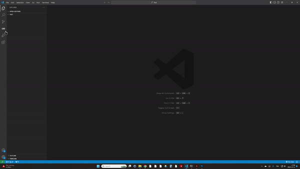
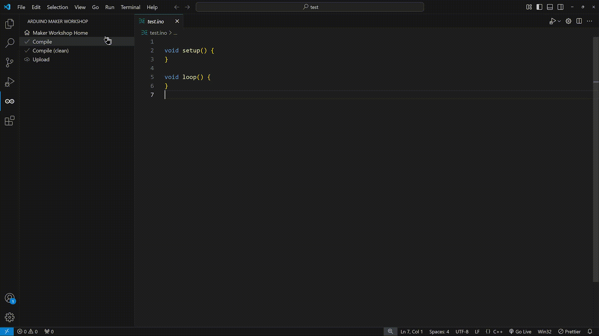
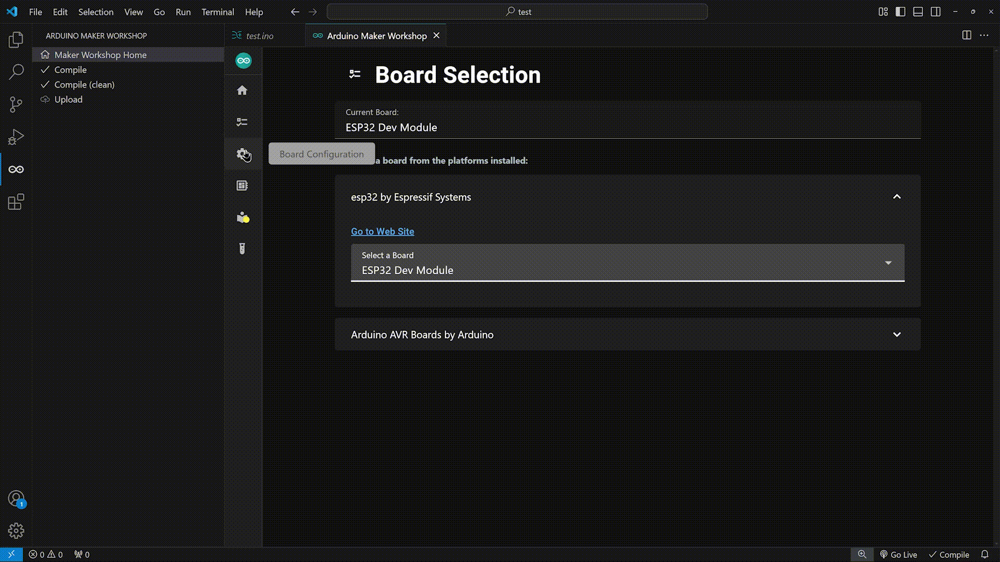
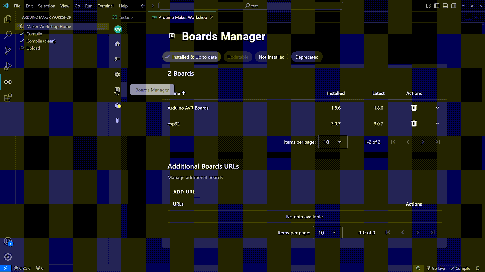

# Arduino Maker Workshop
The ultimate tool for makers to bring Arduino projects to life in Visual Studio Code on Windows.

## Platforms
All the platforms supported by the [Arduino CLI](https://arduino.github.io/arduino-cli) (the CLI is included in this extension).

## New Sketch

## Board Selection

## Board Configuration

## Boards Manager

## Contributors
Contributors are welcomed! Take a look at [the project](https://github.com/users/thelastoutpostworkshop/projects/3) to see features to be implemented or bugs to be fixed

If you want to submit pull requests, [here is how you can do it](https://docs.github.com/en/get-started/exploring-projects-on-github/contributing-to-a-project).

