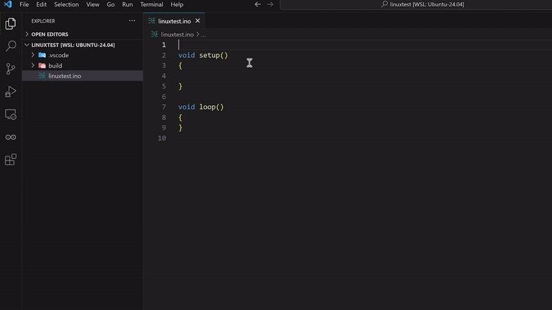
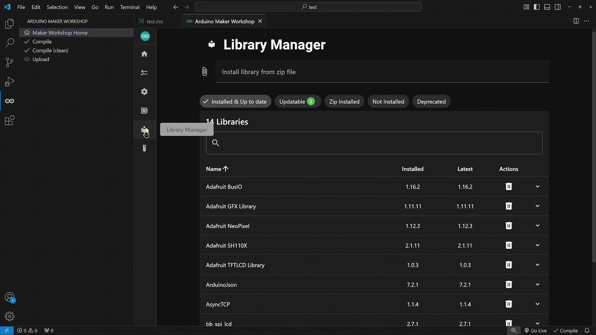
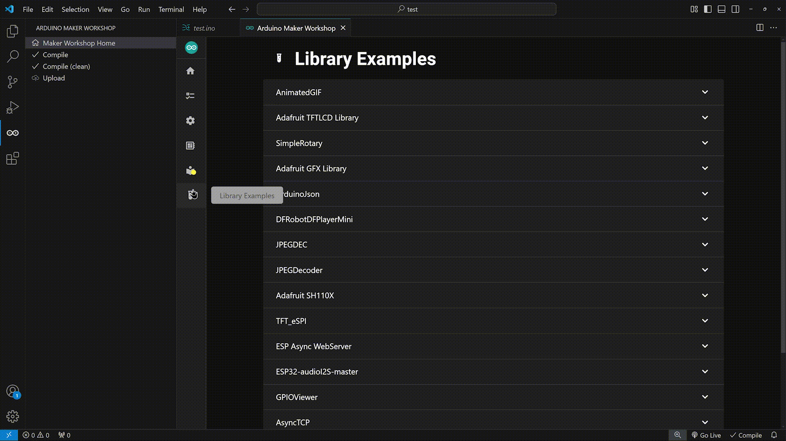

# Arduino Maker Workshop
The ultimate tool for makers to bring Arduino projects to life in Visual Studio Code.

> **Currently supported on Windows x64 and MacOS ARM64/Intel and Linux x64**, help needed for [for other platforms](https://github.com/thelastoutpostworkshop/arduino-maker-workshop/discussions/2)
## Microcontrollers Platforms
All the platforms supported by the [Arduino CLI](https://arduino.github.io/arduino-cli) (the CLI is included in this extension).

## Tutorial : [Get Started](https://youtu.be/rduTUUVkzqM)

## Settings
- You can set the user directory, equivalent of the Arduino IDE's 'sketchbook' directory. Library Manager installations are made to the libraries subdirectory of the user directory
- You can change the Arduino CLI used (*not recommended*) instead of using the built-in Arduino CLI (*recommended*)
- You can disable automatic port detection on Windows

## Arduino Code Snippets : [Documentation](https://github.com/thelastoutpostworkshop/arduino-maker-workshop/blob/main/Arduino_Snippets_Documentation.md)

## New Sketch
> Make sure you have a workspace [open](https://code.visualstudio.com/docs/editor/workspaces).

## Board Selection

## Board Configuration

## Boards Manager

## Library Manager

## Library Example

## About IntelliSense
IntelliSense data (c_cpp_properties.json) is generated after each successful compile.  
For a new project, IntelliSense mark almost everything as "undefined" until you make your first good compile.
IntelliSense is generated based on the arduino-cli build outputs.

## Troobleshooting
If you get this error message:
> No workspace available, open a workspace by using the File > Open Folder... menu, and then selecting a folder

It means you must open a workspace in Visual Studio Code, see the [official documentation](https://code.visualstudio.com/docs/editor/workspaces).

## Contributors
Contributors are welcomed! 
Take a look at [the project](https://github.com/users/thelastoutpostworkshop/projects/3) to see features to be implemented or bugs to be fixed

If you want to submit pull requests, [here is how you can do it](https://docs.github.com/en/get-started/exploring-projects-on-github/contributing-to-a-project).

**Extension Development**
Install the dependancies:
- run `npm install` in the main folder of the extension
- run `npm install` in the webview folder

**Testing**
- Use `npm run watch` in the main folder to debug the extension in Visual Studio Code
- If you modify the webview, you must build it before testing the extension with the command `npm run build`
- You can test the webview in standalone mode using the command `npm run dev`, (in the webview folder). In development the webview uses mock files to simulate call to the Arduino CLI.

