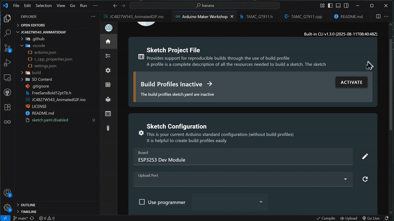
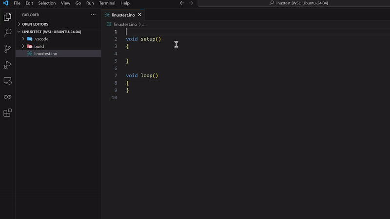
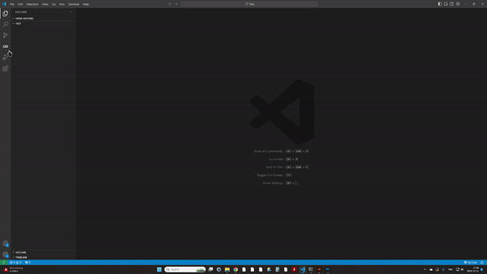
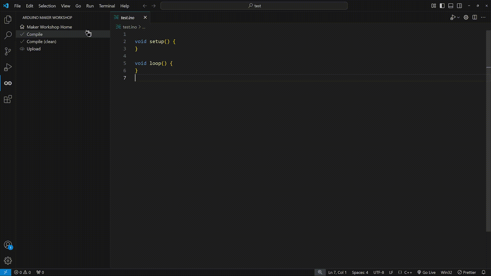
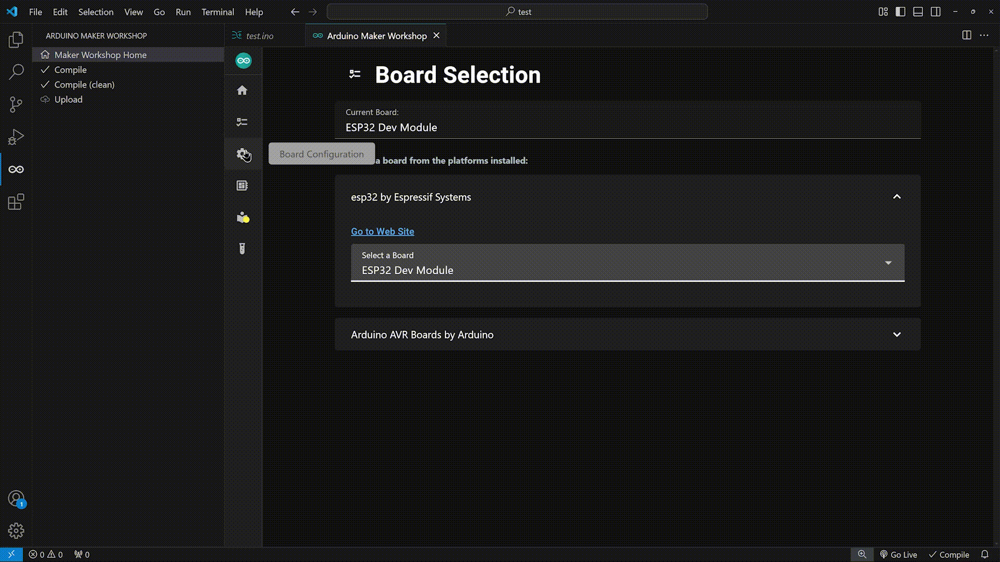
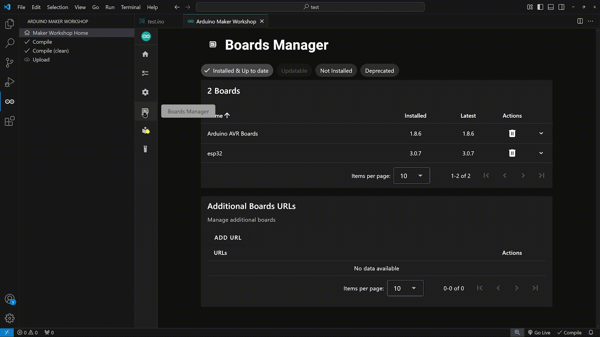
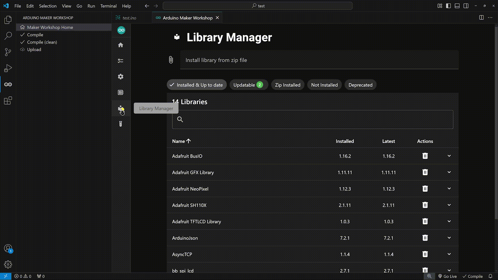
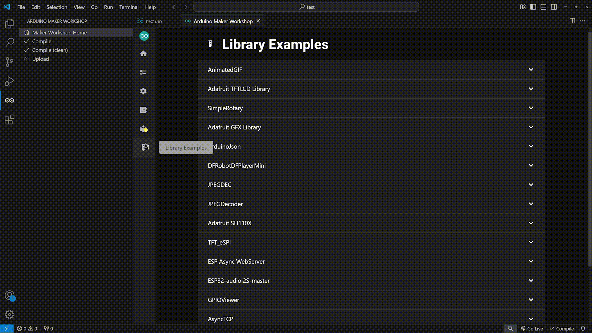

# Arduino Maker Workshop

The ultimate tool for makers to bring Arduino projects to life in Visual Studio Code.
<a href="https://www.buymeacoffee.com/thelastoutpostworkshop" target="_blank">

</a>

## Supported platforms

The following platforms are fully supported:

* Windows x64,
* macOS (Intel + Apple Silicon)
* Linux x64

The following platforms are partially supported:

* Windows ARM: Serial Monitor not supported

### Other platforms

Other platforms are not officially supported yet; you can try installing your own `arduino-cli` and pointing the extension to it, and help is needed for [other platforms](https://github.com/thelastoutpostworkshop/arduino-maker-workshop/discussions/2).

### Micro-controllers Platforms

All the platforms supported by the [Arduino CLI](https://arduino.github.io/arduino-cli) (the CLI is included in this extension).


## Tutorials

* [Getting Started](https://youtu.be/rduTUUVkzqM)
* [Profiles Manager](https://youtu.be/i0gzop0k6yY)


### Settings

* You can set the user directory, equivalent of the Arduino IDE's 'sketchbook' directory. Library Manager installations are made to the libraries subdirectory of the user directory
* You can change the Arduino CLI used (*not recommended*) instead of using the built-in Arduino CLI (*recommended*)
* You can disable automatic port detection on Windows
* You can disable automatic board/library update checks (useful for offline usage)
* You can opt in to an Arduino CLI network connection timeout override for slow board/tool downloads
* You can enable or disable verbose compilation (default is verbose)

## Features

### Profiles Manager (Reproducible build profiles)



Build profiles can define Arduino CLI build properties. Each entry is passed to `arduino-cli compile` as a `--build-property` argument.

Example:

```yaml
profiles:
  sensor-node:
    fqbn: esp32:esp32:esp32
    build_properties:
      - build.extra_flags=-DNODE_SENSOR
      - compiler.cpp.extra_flags=-DDEBUG_NODE
```

This is useful for compiling variants of the same sketch with different `#define` values. The extension also adds these defines to the generated C/C++ IntelliSense configuration.

Only build properties are supported in profiles. Pre-build and post-build commands are not currently supported.

### Arduino Code Snippets

[Documentation](https://github.com/thelastoutpostworkshop/arduino-maker-workshop/blob/main/Arduino_Snippets_Documentation.md)


### New Sketch

> Make sure you have a workspace [open](https://code.visualstudio.com/docs/editor/workspaces).



### Multiple Sketches in One Repository

Arduino Maker Workshop treats the first workspace folder as the active sketch project. To work with several sketches stored in one repository, right-click the desired sketch folder in the Explorer and select **Add as Active Workspace Folder**.

The command adds the folder to the workspace, or moves it to the first position when it is already present. The Home page, board settings, build profiles, compile, and upload actions then use that sketch. You can keep the repository root open as another workspace folder and repeat the command to switch sketches.

### Board Selection



### Board Configuration



### Burn Bootloader

Use **Burn Bootloader** on the Home page to burn the bootloader supplied by the selected board package. Select a board and programmer first; the current port is included when the board package supports it. Burning a bootloader may erase the existing sketch.

### Cortex-Debug Configuration

Use **Generate Cortex-Debug Configuration** on the Home page to create or update a matching entry in `.vscode/launch.json`. The extension asks Arduino CLI for debug metadata for the selected board, programmer, and active build profile, then generates a configuration for the [Cortex-Debug](https://marketplace.visualstudio.com/items?itemName=marus25.cortex-debug) VS Code extension.

Compile with **Optimize compile output for debugging** enabled before starting a debug session. Use **Start Generated Cortex-Debug** to start the matching generated configuration. The configuration connects a debugger to a compatible board; it does not upload the sketch.

### OTA Upload Passwords

For OTA/network uploads that define an Arduino CLI password field, the extension prompts for the password at upload time with a masked VS Code input dialog. The password is passed to `arduino-cli` as an upload field and is not stored in `.vscode/arduino.json`.

### Boards Manager



### Library Manager



### Clear CLI Cache

If the Library Manager or Boards Manager does not refresh after installing cores/libraries externally, use the command palette:

- Open the Command Palette (`Ctrl+Shift+P` / `Cmd+Shift+P`)
- Run `Arduino Maker Workshop: Clear CLI Cache`

### Library Example



### About IntelliSense

IntelliSense data (`c_cpp_properties.json`) is generated after each successful compile.  
For a new project, IntelliSense mark almost everything as "undefined" until you make your first good compile.
IntelliSense is generated based on the arduino-cli build outputs.
If you add custom C/C++ configurations, the extension preserves them and only updates the generated `Arduino` configuration.

## Troubleshooting

If you get this error message:
> No workspace available, open a workspace by using the File > Open Folder... menu, and then selecting a folder

It means you must open a workspace in Visual Studio Code, see the [official documentation](https://code.visualstudio.com/docs/editor/workspaces).

### Slow Board Or Tool Downloads

Arduino CLI's default network inactivity timeout is 60 seconds. Large platform downloads, such as ESP32 tools, can fail on slow connections with errors like `context deadline exceeded` or `Client.Timeout`.

To let Arduino Maker Workshop set a longer Arduino CLI timeout, enable:

- `arduinoMakerWorkshop.arduinoCLI.networkConnectionTimeoutEnabled`
- `arduinoMakerWorkshop.arduinoCLI.networkConnectionTimeoutValue` (default: `600s`)

When the override is disabled, the extension leaves Arduino CLI's timeout at its default. If the extension previously applied the override, disabling it removes `network.connection_timeout` from the Arduino CLI config.

## Contributors

Contributors are welcomed! 
Take a look at [the project](https://github.com/users/thelastoutpostworkshop/projects/3) to see features to be implemented or bugs to be fixed

If you want to submit pull requests, [here is how you can do it](https://docs.github.com/en/get-started/exploring-projects-on-github/contributing-to-a-project).

## Extension Development

Install the dependencies:

* run `npm install` in the main folder of the extension
* run `npm install` in the webview folder

## Testing

* Use `npm run watch` in the main folder to debug the extension in Visual Studio Code
* If you modify the webview, you must build it before testing the extension with the command `npm run build`
* You can test the webview in standalone mode using the command `npm run dev`, (in the webview folder). In development the webview uses mock files to simulate call to the Arduino CLI.
